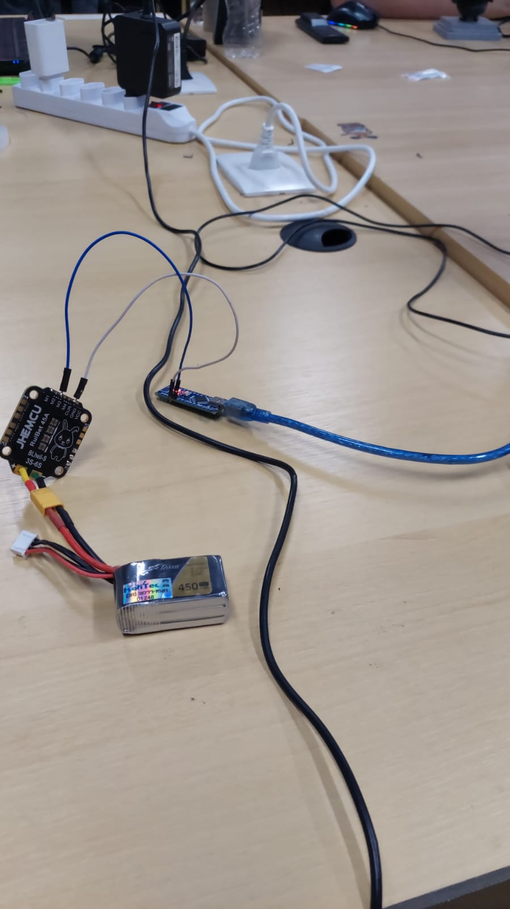
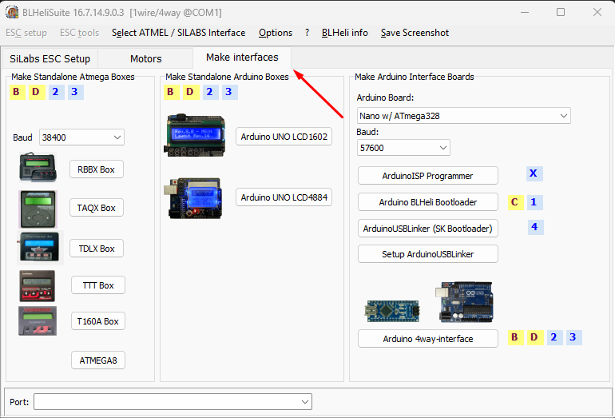
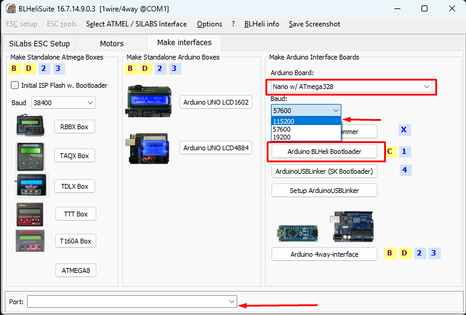
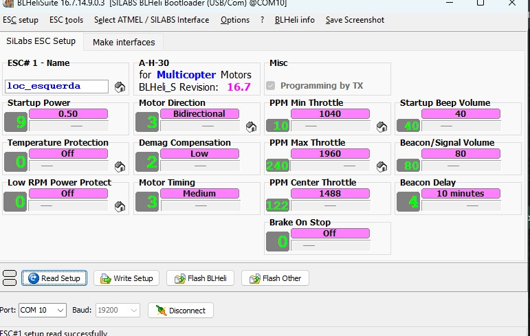

# Atualização de Firmware ESC Brushless

Este repositório é destinado ao aprendizado de como atualizar o firmware de ESCs brushless.

Os ESCs brushless podem ser **BLHeli_S** ou **BLHeli_32**. Neste guia, utilizaremos o seguinte modelo como exemplo:
- **Flycolor Raptor BLS Pro BLHeli_S 30A 2-4S DSHOT ESC Brushless**

---

## 📋 Materiais Necessários

- ESC brushless BLHeli_S
- Arduino Nano
- Bateria de alimentação (2S/3S) ligada ao ESC
- Cabo micro USB
- Jumpers

---

## 🔌 Esquemático de Conexão

### Conexões do Arduino Nano:
- **D3** → Sinal do ESC
- **GND** → GND do ESC
- **Micro USB** → Porta USB do computador

### Alimentação do ESC:
- O ESC deve estar alimentado com uma bateria 2S ou 3S

### Diagrama do Circuito:

> **Obs:** Na imagem há algumas gambiarras. Recomenda-se fazer as conexões de forma mais segura.

---

## 🛠️ Passo a Passo

### 1º Passo: Conectar o Arduino Nano
- Conecte o Arduino Nano ao computador via cabo micro USB
- Verifique qual porta COM foi gerada (pode ser verificada no Gerenciador de Dispositivos do Windows)

### 2º Passo: Abrir o BLHeliSuite
- Execute o arquivo `BLHeliSuite.exe` localizado na pasta do projeto

### 3º Passo: Acessar "Make Interfaces"
- No menu superior, escolha a opção **"Make Interfaces"**

### 4º Passo: Configurar o Arduino como Interface
Nesta aba, configure os seguintes parâmetros:

- **a)** "Arduino Board" → **"Nano w/ATmega"**
- **b)** Baud → **115200** (pode variar conforme o seu hardware, teste se necessário)
- **c)** No canto inferior esquerdo, selecione a **porta COM correta** do Arduino Nano
- **d)** Clique em **"Arduino BLHeli Bootloader"**

> ✅ Você deve obter uma mensagem de **Sucesso!**

### 5º Passo: Conectar ao ESC
Volte para a aba **"Silab ESC Setup"**. No canto inferior direito, configure:

1. Selecione a **Porta COM**
2. Defina o **Baud**
3. Clique em **"Connect"**
4. Clique em **"Read Setup"**

Ao final desses passos, você obterá a seguinte tela:

---

## ⚙️ Configurações Recomendadas

Agora com tudo configurado, você pode personalizar as configurações do ESC. Para aplicações de **combate de robôs**, recomendo as seguintes configurações:

| Parâmetro | Valor Recomendado | Observação |
|-----------|-------------------|------------|
| **Motor Direction** | Normal ou Bidirectional | Normal para armas; Bidirectional para locomoção tangenciada |
| **Temperature Protection** | Off | - |
| **PPM Min Throttle** | 1040 | - |
| **PPM Max Throttle** | 1960 | - |
| **Low RPM Power Protect** | Off | - |
| **PPM Center Throttle** | 1500 | - |
| **Brake On Stop** | Off | - |

> **Nota:** As demais configurações podem ser deixadas no padrão. Sinta-se à vontade para pesquisar e experimentar outras opções conforme sua necessidade.

---

## 💡 Considerações Finais

Essas configurações foram obtidas com a ajuda de **Gabriel da equipe RSM**, dono do robô antweight **Wigow**. 

Este guia apresenta configurações que funcionaram bem em testes práticos, mas recomenda-se pesquisar mais sobre cada parâmetro para otimizar conforme suas necessidades específicas. Até o momento, essas configurações têm apresentado excelente desempenho.

---

## 🤝 Créditos

- **Gabriel** - Equipe RSM
- Robô antweight: **Wigow**

